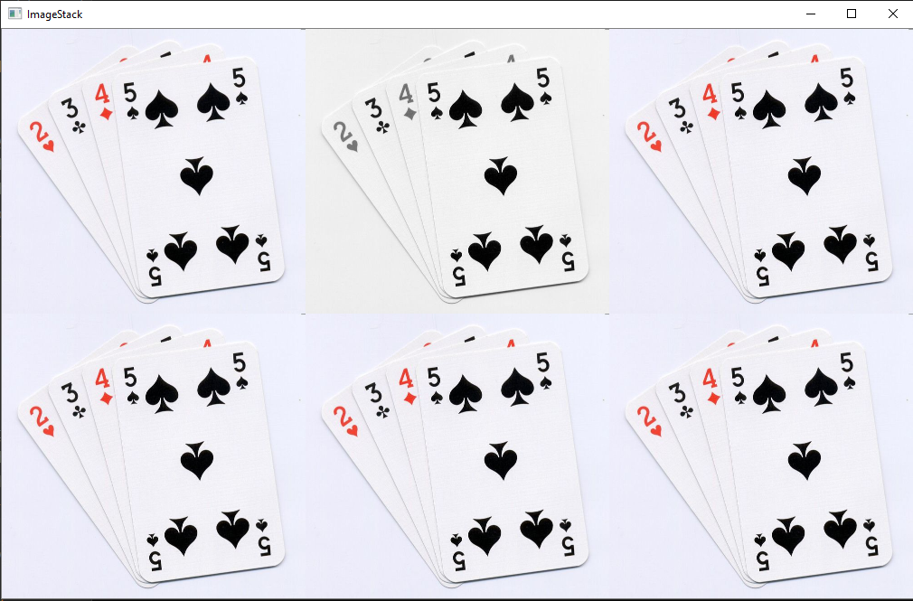
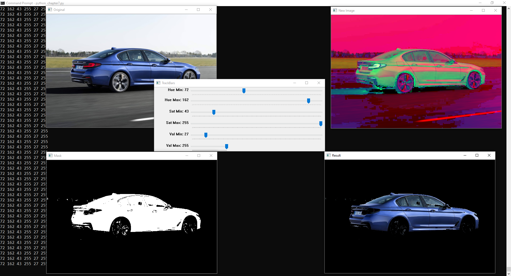
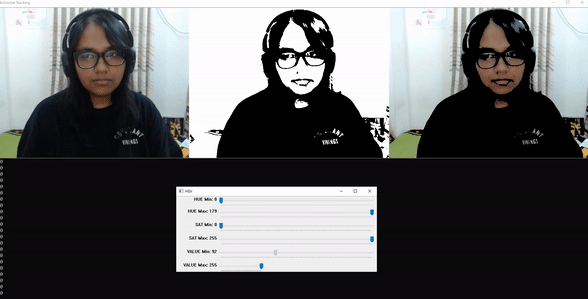

# openCV
Chapter 1:
Read Images, Videos and Webcam
Chapter 2:
Convert original picture to:

Gray Picture:

Blur Picture:

Canny Edges:

Dialation Image:

Eroded Image of dialated image:

Chapter 3:
Resized image:

Cropped image:

Chapter 4:
draw shapes:

Chapter 5:

warped image:

Chapter 6:

Horizontal and Vertical stacked images:

Chapter 7:

Color detection changing hue,  saturation and value

Color detection from webcam changing hue,  saturation and value

